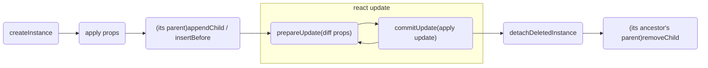
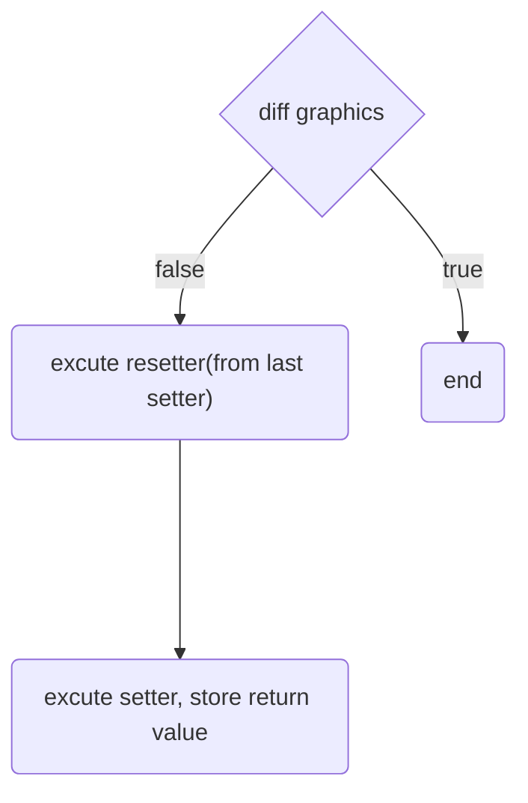
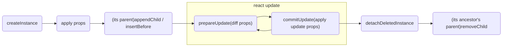
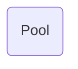

# How to write a react renderer

introduction of egreact

---
layout: section
---
# 1 Idea

---

# Why ?

## uncomfortable 
<br/>

- ❌ 🔔 no tip
- ❌ ⚫ any hacks
- ❌ 📦 extra packaging
- ❌ 📖 need compiler

<br/>
<br/>

**From the current front-end development perspective, exml's poor authoring experience and isolated ecology have lagged behind the mainstream.**

::title::

why

---

## advantage

<br/>

- **react is borned for ui**
- react ecosystems, such as react-router, state manage libraries, hooks libraries and test libraries
- flexible between template and jsx
- egret native ? 

::title::

why

---

A similar and mature open source libray :

## react-three

<br/>

<iframe src="https://codesandbox.io/embed/basic-demo-rrppl0y8l4?fontsize=14&hidenavigation=1&theme=dark"
     style="width:100%; height:300px; border:0; border-radius: 4px; overflow:hidden;"
     title="Basic demo"
     allow="accelerometer; ambient-light-sensor; camera; encrypted-media; geolocation; gyroscope; hid; microphone; midi; payment; usb; vr; xr-spatial-tracking"
     sandbox="allow-forms allow-modals allow-popups allow-presentation allow-same-origin allow-scripts"></iframe>

::title::

react-three

---

<iframe src="https://codesandbox.io/embed/still-frost-kbmgk0?fontsize=14&hidenavigation=1&theme=dark"
     style="width:100%; height:450px; border:0; border-radius: 4px; overflow:hidden;"
     title="still-frost-kbmgk0"
     allow="accelerometer; ambient-light-sensor; camera; encrypted-media; geolocation; gyroscope; hid; microphone; midi; payment; usb; vr; xr-spatial-tracking"
     sandbox="allow-forms allow-modals allow-popups allow-presentation allow-same-origin allow-scripts"
   ></iframe>

::title::

egreact

---
layout: section
---

# 2 Implement

---

### There is an interface named `HostConfig` to define a renderer

<br/>

Think about react-dom: <v-click> **createElement, appendChild, insertBefore and removeChild.** </v-click>

<v-click>

```ts {all|2-3|5-10|11-13|all}
  const HostConfig = {
    // create a host instance
    createInstance,

    // host actions
    appendChild,
    insertBefore,
    removeChild,
    detachDeletedInstance, // clean effects

    // props diff and apply
    prepareUpdate,
    commitUpdate,

    ...others
  }
```

</v-click>

::title::

HostConfig

---

# Lifecycle of a host instance 

<br/>
<br/>



<v-click>

- diff props 
- apply updates

</v-click>

<br/>
<v-click>

### Description for a host component

</v-click>

::title::

lifecycle

---

<!-- # design an interface to describe a host component -->

# Expandsive Prop

``` ts
interface IPropHandler{
    __Class: new (...args: any) => any, // constructor
    [key in string]: PropSetter, // function for updating
    [key in `__diff_${string}`]: DiffHandler // function for diff
}
```
<br/>

<!-- <v-click>

### For TypeScript

any specific description's key with prefix `__`

</v-click> -->

<v-click>

**clear last prop setter effect, inspired by `useEffect`**

```ts
type PropResetter = void | ((removed: boolean) => void)
type PropSetter = (args:any) => PropResetter
```

</v-click>


::title::

prop design

---

<div style="transform-origin:left top;transform:scale(0.8)">

```jsx
  <shape graphics={[['beginFill', 0x000000],['drawRect', 0, 0, 300, 100],['endFill']]}></shape>  
```

```ts {all|3|4|18|13|5-17|13|all}
import { Setters } from 'egreact'
const shape = {
  ...Setters.egret.displayObject,
  __Class: egret.Shape,
  graphics: ({
    newValue,
    instance,
  }:{ newValue: ['string',...any[]] | Function,instance: { graphics: egret.Graphics }}) => {
    if (is.arr(newValue)) { 
      for (const action of newValue) {
        instance.graphics[action[0]](...action.slice(1))
      }
      return () => instance.graphics.clear()
    } else if (is.fun(newValue)) {
      return newValue(instance.graphics, instance)
    }
  },
  __diff_graphics: (np: any, op: any) => {
    if (is.arr(np) && is.arr(op)) {
      np = np.flat(1)
      op = op.flat(1)
      if (np.length !== op.length) return false
      for (let i = 0; i < np.length; i++) {
        if (np[i] !== op[i]) return false
      }
      return true
    } else return np === op
  }
}
```

</div>

<div class="absolute" style="right: 0;bottom: 20px;">



</div>

::title::

example

---

1. declare jsx
2. call `extend` to let egreact add a host component

```ts
import { TransProp, extend } from 'egreact'
import shape from './shape'
declare global {
  namespace JSX {
    shape: TransProp<typeof shape>
  }
}
extend({
  Shape: shape
})
```

::title::

example

---
layout: section
---
# 3 Accessibility

---

- **`<Egreact></Egreact>`**

A component in react-dom context, `<Egreact>` will `runEgret`

```tsx
import { Egreact, EgreactLink } from "egreact";
function App() {
  return 
    (<div>
      <Egreact>
        <eui-group layout="vertical" layout-gap={20}>
          {/** egreact context... **/}
        </eui-group>
      </Egreact>
    </div>)
}
```

::title::
entry

---

- **`createEgreactRoot`**

Writing react component and use it like a skin

```tsx
import React from 'react'
import { createEgreactRoot } from 'egreact'
class EgreactRender extends egret.DisplayObjectContainer {
  root = createEgreactRoot(this)
  constructor(reactNode: React.ReactNode) {
    super()
    this.addEventListener(egret.Event.ADDED, () => this.root.render(reactNode), this)
    this.addEventListener(egret.Event.REMOVED, () => this.root.unmount(), this)
  }
}
const displayObjectContainer = new egret.displayObjectContainer();
displayObjectContainer.addChild(new EgreactRender(
    <sprite graphics={[['beginFill', 0x000000],['drawRect', 0, 0, 300, 100],['endFill']]}>
      <textField size={16}>Hello, egreact</textField>
    </sprite>  
))
```

::title::
entry

---

- **`primitive`**

insert egret instance/class in egreact context

```tsx {all|3|10}
<displayObjectContainer>
  <primitive
    object={container}
    key={container.$hashCode}
    onTouchTap={()=> setX((x) => x + 50)}
    x={x}>
    <eui-rect fillColor={0x888888} width={100} height={100}></eui-rect>
  </primitive>
  <primitive 
    constrctor={ButtonSkin}
    borderRadius={50}
    strokeWeight={2}
    isStroke={true}
  />
</displayObjectContainer>
```

::title::
primitive

---

# If sub component is a prop...

syntax sugar in exml
```xml
<e:Scroller> 
    <e:Group/> 
</e:Scroller>
```

original syntax

```xml
<e:Scroller> <e:viewport> <e:Group/> </e:viewport> </e:Scroller>
```

<v-click>

in egreact 

```tsx
<eui-scroller> 
  <eui-group attach="viewport"/> 
</eui-scroller>
```

**use `attach` to change the way of adding** from `scroller.addChild(group)` to `scroller.viewport = group`


</v-click>

::title::
change the way of adding

---

# If prop is an object...

```ts
const layout = new eui.VerticalLayout();
layout.gap = 10;
group.layout = layout;
```
<br/>

### exml

<br/>

```html
<e:Group>
  <e:layout>
    <e:VerticalLayout gap="10" />
  </e:layout>
</e:Group>
```
<br/>

<v-click>

why a prop look like a sub component?

</v-click>


::title::

object prop

---

# If prop is an object...

```ts
const layout = new eui.VerticalLayout();
layout.gap = 10;
group.layout = layout;
```

<br/>

**Prop should be described at tag...**

<br/>

<v-click>

```jsx
<eui-group layout="vertical" layout-gap={10}></eui-group>
```

</v-click>


::title::

object prop

---

# Same interface

Prop on different host components has the same interface.


::title::

interface prop

----

```ts
scrollRect
scrollRect-width
scrollRect-height
scrollRect-others...
scrollRect-bottomRight
scrollRect-bottomRight-x
scrollRect-bottomRight-y
scrollRect-topLeft
scrollRect-topLeft-x
scrollRect-topLeft-y

scale9Grid
scale9Grid-width
scale9Grid-height
scale9Grid-others...
scale9Grid-bottomRight
scale9Grid-bottomRight-x
scale9Grid-bottomRight-y
scale9Grid-topLeft
scale9Grid-topLeft-x
scale9Grid-topLeft-y

```

`${name}-${first}-${second}-${third}...`

<v-click>

<div style="position: absolute;border: 2px solid red;height:390px;width:90px;left:90px;top:90px;" />

<div style="position: absolute;border: 2px solid red;height:40px;width:150px;left:90px;top:237px;" />

<div style="position: absolute;border: 2px solid red;height:40px;width:150px;left:90px;top:436px;" />

</v-click>

::title::

interface prop

---


```ts
const pointProp = {
  __Class: egret.Point,
  __setter: Point.setter,
  __diff: Point.diff,
  x: NormalProp.num,
  y: NormalProp.num,
}

const rectangleProp = {
  __Class: egret.Rectangle,
  __setter: Rectangle.setter,
  __diff: Rectangle.diff,
  bottomRight: pointProp,
  topLeft: pointProp,
  ...others
}
```

**Generate props recursively**

<v-click>

- what about the type?
 
</v-click>

::title::

interface prop

---

```ts{all|1|8-9|4-6|15-16}
// flat object，such as `{ a: { b: string }, b: number }` will be translated into `{ a-b: string, b: number }`

type ToUnionOfFunction<T> = T extends any ? (x: T) => any : never
// { a-b: string } | { b: number } => { a-b: string } & { b: number }
// { a-b: string, b: number }
type UnionToIntersection<T> = ToUnionOfFunction<T> extends (x: infer P) => any ? P : never

// { a: { b: string }, b: number } => { a-b: string } | { b: number }
type FlattenObjectToIntersection<T extends object, S extends string> = {
  [K in Exclude<keyof T, Symbol>]: T[K] extends object
    ? FlattenObjectToIntersection<T[K], `${S}${K}-`>
    : { [_ in `${S}${K}`]: T[K] }
}[Exclude<keyof T, Symbol>]

// { a: { b: string }, b: number } => { a-b: string, b: number }
type FlattenObject<T extends object> = UnionToIntersection<FlattenObjectToIntersection<T, ''>>

```

::title::

interface prop


---

Think about `<eui-group layout-gap={10} layout="vertical"></eui-group>`

**If `layout` update from `vertical` to `horizontal`, will effect `layout-gap` ?**

<v-click>

## prefix prop update effect

<br/>

<v-click>

1. sort props by the length of keys to **ensure the order**.<br/>
  props: `['layout-gap', 'layout']` => `['layout', 'layout-gap']`<br/>
  changes:`[]`

</v-click>

<v-click>

2. push `layout` change to `changes`<br/>
  changes:`[] => [['layout', any change]]`

</v-click>

</v-click>

::title::
prefix prop update effect
---

when traverse at `layout-gap`

| pre\sub | no change | update | remove   |
| ------- | --------- | ------ | -------- |
| update  | after     | after  | -/before |
| remove  | -         | after  | -/before |

<br/>

- when `sub` is `remove`, its change must be inserted before `pre`
- when `pre` is `update`, its `sub` must be applied again

<!-- 3.2 if `layout` is update, no matter whether `layout-gap` update, change inserted **after** the change of its prefix prop, because **`layout-gap` should be applied again after its prefix prop new instance created.**

changes:`[['layout','vertical']] => [['layout','horizontal'],['layout-gap',10]]` -->

::title::
prefix prop update effect

---

# If use contexts...

```tsx {all|10-12,18-19}
const App = () => {
  const count = useSelector((state: RootState) => state.counter.value)
  const dispatch = useDispatch()
  return (
    <div>
      <h2 onClick={() => dispatch(increment())}>
        i have been click {count} times!
      </h2>
      <ErrorBoundary>
        <Egreact contextsFrom={false}>
          <SubComponent />
        </Egreact>
      </ErrorBoundary>
    </div>
  )
}
const SubComponent = () => {
  const dispatch = useDispatch()
  return <sprite onTouchTap={() => dispatch(increment())} />
}
export default () =>(<Provider store={store}><App/></Provider>)
```

**Redux use context, but a new renderer can't inherit context.**

::title::
context bridge

---
layout: image-right
image: https://standard.ai/static/31b111d61d8b0235e7dc0cd7c448d8af/1290d/standard-view-fig-1.webp

---
# Context Bridge

<br/>

1. collect contexts from fiber
2. collect values from contexts by useContext
3. generator Provider for new renderer 

---

**collect contexts from fiber**


```tsx {all|2-5|6-12}
export function collectContextsFromDom(dom: HTMLElement) {
  const fiberKey = Object.keys(dom).find(
    (key) => key.startsWith('__react') && dom[key]?.stateNode === dom,
  )
  let fiber = dom[fiberKey]
  const contexts: React.Context<any>[] = []
  while (fiber) {
    if (fiber.type?._context) {
      contexts.push(fiber.type._context)
    }
    fiber = fiber.return
  }
  return contexts
}
```

::title::
context bridge

---

**collect values from contexts by useContext**

```tsx {all|4-6,13}
export const ContextListeners = memo(
  ({ contexts, values }: { contexts: React.Context<any>[]; values: CallBackArray }) => (
    <>
      {contexts.map((context, index) => (
        <ContextListener key={index} context={context} values={values} index={index} />
      ))}
    </>
  ),
)

export const ContextListener = memo(
  ({ context, values, index }: { context: React.Context<any>; values: CallBackArray; index: number }) => {
    values[index] = useContext(context)
    return null;
  },
)
```

<v-click>

**why not `contexts.map((context, index) => (values[index] = useContext(context))` in `ContextListeners` directly?**

</v-click>

::title::
context bridge

---


```tsx {all|8,13-14|17-23}
export const ContextProviders = memo(
  ({
    contexts,
    values,
    children,
  }: {
    contexts: React.Context<any>[]
    values: CallBackArray
    children: React.ReactNode
  }) => {
    const [, update] = useState({})
    useEffect(() => {
      values.setCallback(() => update({}))
      return () => values.setCallback(() => void 0)
    }, [])

    return contexts.reduce(
      (child, Context, index) => 
        (<Context.Provider value={values[index]}>
          {child}
        </Context.Provider>),
      children,
    ) as JSX.Element
  },
)
```

::title::
context bridge

---





::title::
Pool

---

# react devtool

**`reconciler.injectIntoDevTools`: view component tree**

<br/>


::title::
react devtool

---

# How picker implement?

1. listener `onMouseEnter` at window
2. get dom when emit envent
3. call `getComputedStyle` and dom methods, such as `getBoundingClientRect`, to computed the position and size of the shadow, then show shadow
4. call `findFiberByHostInstance`, next find corresponding node in component tree by fiber, finally jump to the position of the node

<br/>

<v-click>

## adapt

1. proxy `window.listener`
2. proxy `window.getComputedStyle`
3. mock dom attributes/methods is used in devtool

</v-click>

::title::
react devtool

---

1. judge is the mouse event point in canvas

```ts
function proxyHandler(e: MouseEvent){
  const { pageX: x, pageY: y } = e
  const r = document.querySelector('.egret-player > canvas').getBoundingClientRect()
  r.x += window.scrollX
  r.y += window.scrollY
  const isInCanvas = r.x > r.x && x < r.x + r.width && y > r.y && y < r.y + r.height
  ...
```

2. find the most suitable egret host instance

```ts
const scale = r.width / egret.lifecycle.stage.stageWidth
const target = findTargetByPosition(egret.lifecycle.stage, (x - r.x) / scale, (y - r.y) / scale)
```

3. mock a new event, change target from dom to egret instance

```ts
e = {
  ...e,
  preventDefault: e.preventDefault.bind(e),
  stopPropagation: e.stopPropagation.bind(e),
  target,
}
listener.call(this, e) // react devtool handler
```

::title::
react devtool

---

<div style="transform: scale(0.7);transform-origin:left top;"> 

```ts {all|18-30|24}
/**
 *
 * @copyright Copyright egret inject.
 * @description 寻找显示对象中符合舞台位置的最深的子显示对象（包含自身）
 */
export function findTargetByPosition(
  displayObject: egret.DisplayObject,
  stageX: number,
  stageY: number,
): egret.DisplayObject | null {
  if (!displayObject.visible) { return null }
  const matrix = displayObject.$getInvertedConcatenatedMatrix()
  const x = matrix.a * stageX + matrix.c * stageY + matrix.tx
  const y = matrix.b * stageX + matrix.d * stageY + matrix.ty
  const rect = displayObject.$scrollRect ? displayObject.$scrollRect : displayObject.$maskRect
  if (rect && !rect.contains(x, y)) { return null }
  if (this?.$mask && !displayObject.$mask.$hitTest(stageX, stageY)) { return null }
  const children = displayObject.$children
  let notTouchThrough = false
  if (children) {
    for (let index = children.length - 1; index >= 0; index--) {
      const child = children[index]
      if (child.$maskedObject) { continue }
      var target = findTargetByPosition(child, stageX, stageY)
      if (target && target.ispTouchThrough !== true) {
        notTouchThrough = true
        break
      }
    }
  }
  if (target) { return target }
  if (notTouchThrough) { return displayObject }
  return displayObject.$hitTest(stageX, stageY)
}
```

</div> 


::title::
react devtool

---

# vscode plugin - exml2egreact

search in vscode plugin marketplace, then 


::title::
exml2egreact

---

```xml
<?xml version="1.0" encoding="utf-8"?>
<e:Skin class="skins.RadioButtonSkin" states="up,down,disabled,upAndSelected,downAndSelected,disabledAndSelected" xmlns:e="http://ns.egret.com/eui">
    <e:Group width="100%" height="100%">
        <e:layout>
            <e:HorizontalLayout verticalAlign="middle"/>
        </e:layout>
        <e:Image fillMode="scale" alpha="1" alpha.disabled="0.5" alpha.down="0.7"
                 source="radiobutton_unselect_png"
                 source.upAndSelected="radiobutton_select_up_png"
                 source.downAndSelected="radiobutton_select_down_png"
                 source.disabledAndSelected="radiobutton_select_disabled_png"/>
        <e:Label id="labelDisplay" size="20" textColor="0x707070"
                 textAlign="center" verticalAlign="middle"
                 fontFamily="Tahoma"/>
    </e:Group>
</e:Skin>
```
::title::
exml2egreact

---

<div style="transform-origin:left top;transform:scale(0.7)">

```tsx
import React, { useRef, useState, useEffect } from "react";

export default function RadioButtonSkin({ context }) {
  const { currentState } = context;

  const labelDisplayRef = useRef<eui.Label>(null!);

  useEffect(() => {
    context.labelDisplay = labelDisplayRef.current;
  });

  return (
    <>
      <eui-group width="100%" height="100%" layout="horizontal">
        <eui-image
          fillMode="scale"
          alpha={{ disabled: 0.5, down: 0.7 }[currentState] ?? 1}
          source={
            {
              upAndSelected: "radiobutton_select_up_png",
              downAndSelected: "radiobutton_select_down_png",
              disabledAndSelected: "radiobutton_select_disabled_png"
            }[currentState] ?? "radiobutton_unselect_png"
          }
        />
        <eui-label
          size={20}
          textColor={0x707070}
          textAlign="center"
          verticalAlign="middle"
          fontFamily="Tahoma"
          ref={labelDisplayRef}
        />
      </eui-group>
    </>
  );
}
```

</div>


::title::
exml2egreact

---
layout: section
---

# 4 Engineering

---

- 💼 **pnpm monorepo**
- 📦 **rollup + tsc**
- 🧪 **jest + @testing-library/react (99%)**
- 🎺 **github action**
- 📄 **dumi (https://xingxinglieo.github.io/egreact/)**


::title::
Engineering